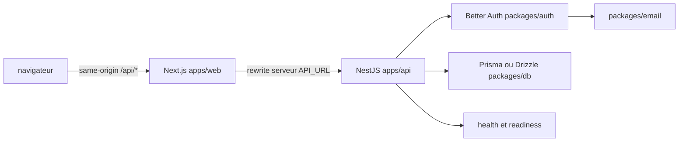

# BetterNest Boilerplate

[](https://www.npmjs.com/package/create-betternest-app)
[](./LICENSE)
[](https://github.com/bellandry/betternest-boilerplate/actions/workflows/ci.yml)
[](./CONTRIBUTING.md)

**BetterNest Boilerplate** est un générateur de monorepo pour démarrer rapidement une application web full-stack avec **Next.js**, **NestJS**, **Better Auth**, **Turborepo** et une base de données au choix. Le CLI `create-betternest-app` assemble un projet cohérent à partir de templates composables, puis peut installer ses dépendances et initialiser Git automatiquement.

> Cette version fournit une base solide et réutilisable pour un produit réel. Elle ne remplace pas une revue de sécurité, une stratégie de sauvegarde ni une validation d’architecture adaptée à votre contexte métier.

## Sommaire

- [Objectifs et principes](#objectifs-et-principes)
- [Prérequis](#prérequis)
- [Démarrage en cinq minutes](#démarrage-en-cinq-minutes)
- [Utiliser le CLI](#utiliser-le-cli)
- [Choisir sa base de données](#choisir-sa-base-de-données)
- [Structure d’un projet généré](#structure-dun-projet-généré)
- [Architecture applicative](#architecture-applicative)
- [Configuration de l’environnement](#configuration-de-lenvironnement)
- [Développement local](#développement-local)
- [Authentification](#authentification)
- [Base de données et migrations](#base-de-données-et-migrations)
- [API, proxy et santé](#api-proxy-et-santé)
- [Sécurité et exploitation](#sécurité-et-exploitation)
- [Déploiement](#déploiement)
- [Tester le générateur](#tester-le-générateur)
- [Étendre la boilerplate](#étendre-la-boilerplate)
- [Versionner et publier le CLI](#versionner-et-publier-le-cli)
- [Dépannage](#dépannage)
- [Contribuer](#contribuer)
- [Références](#références)

## Objectifs et principes

BetterNest vise à réduire le temps passé à assembler les briques communes d’une application SaaS ou métier, sans enfermer le projet dans une seule base de données ni dans un seul hébergeur.

Le navigateur communique avec une **origine unique**, celle de l’application Next.js. Les appels `/api/*` sont réécrits côté serveur par Next.js vers l’API NestJS. Les cookies de session restent ainsi first-party sur le domaine visible par l’utilisateur, tandis que le backend peut être hébergé séparément sur Railway, Fly.io, Render, un VPS ou toute autre plateforme compatible Docker.

Les décisions structurantes sont les suivantes :

| Domaine             | Choix fourni                                                                       |
| ------------------- | ---------------------------------------------------------------------------------- |
| Frontend            | Next.js 16, App Router, Tailwind CSS v4 et composants UI partagés                  |
| Backend             | NestJS 11 avec Express 5                                                           |
| Authentification    | Better Auth, email/mot de passe, Google et GitHub                                  |
| Monorepo            | pnpm workspaces et Turborepo                                                       |
| Base de données     | Prisma ou Drizzle avec PostgreSQL, MySQL ou SQLite                                 |
| Déploiement         | Docker, Vercel, Railway, Fly.io, Render ou VPS                                     |
| Protection intégrée | Validation d’environnement, rate limiting auth, headers de sécurité, health checks |

Le dépôt courant est le **système de templates et le générateur**. Il n’est pas destiné à être lancé comme une application métier depuis sa racine. Pour créer une application, utilisez le CLI.

## Prérequis

Pour utiliser le CLI et développer la boilerplate, installez les outils suivants :

| Outil   | Version attendue                 | Rôle                                                                                   |
| ------- | -------------------------------- | -------------------------------------------------------------------------------------- |
| Node.js | `>=20.9.0`                       | Exécuter le CLI, Next.js et NestJS                                                     |
| pnpm    | `10.x`, version générée `10.6.3` | Installer les dépendances et gérer le workspace                                        |
| Git     | Version récente                  | Versionner le projet généré                                                            |
| Docker  | Récent, optionnel                | Nécessaire uniquement pour PostgreSQL ou MySQL en local et pour construire l’image API |

Le monorepo généré supporte officiellement **pnpm**. Le CLI lui-même peut être lancé avec `npx`, mais le projet produit contient des scripts et un workspace pnpm : installez donc pnpm avant de travailler dans le projet généré.

Vérifiez votre environnement :

```bash
node --version
pnpm --version
git --version
docker --version       # optionnel
```

## Démarrage en cinq minutes

La commande la plus simple utilise Prisma avec SQLite. Elle ne nécessite ni Docker ni serveur de base de données externe.

```bash
npx create-betternest-app my-app --db=prisma-sqlite --yes
cd my-app

cp .env.example .env
cp apps/web/.env.example apps/web/.env

# Générez un secret de session et placez-le dans .env.
openssl rand -base64 32

pnpm install
pnpm db:push
pnpm dev
```

L’application est alors disponible sur [http://localhost:3000](http://localhost:3000) et l’API écoute par défaut sur le port `4000`. Le proxy Next.js permet aux pages du frontend d’appeler `/api/*` sans cibler directement le port de l’API.

Avant toute utilisation réelle, remplacez les valeurs d’exemple, configurez les fournisseurs OAuth souhaités et lisez le [guide de déploiement](./templates/base/DEPLOYMENT.md) inclus dans le projet généré.

## Utiliser le CLI

### Installation ponctuelle

```bash
npx create-betternest-app my-app
```

### Installation globale

```bash
npm install --global create-betternest-app
create-betternest-app my-app
```

### Mode interactif

Sans option, le CLI vous guide pour sélectionner le nom du projet, la base de données, les providers d’authentification, l’installation des dépendances et l’initialisation Git :

```bash
create-betternest-app my-app
```

### Mode automatisé

Pour un script ou une CI, fournissez toutes les décisions et utilisez `--yes` :

```bash
npx create-betternest-app my-app \
  --db=prisma-postgresql \
  --auth=email-password,google \
  --pm=pnpm \
  --yes
```

### Prévisualiser sans écrire de fichiers

`--dry-run` résout la sélection, affiche le plan et quitte sans générer de fichiers, initialiser Git ni installer de dépendances :

```bash
npx create-betternest-app my-app \
  --db=drizzle-sqlite \
  --auth=email-password \
  --dry-run \
  --yes
```

### Options disponibles

| Option            | Valeur                               | Description                                             |
| ----------------- | ------------------------------------ | ------------------------------------------------------- |
| `[project-name]`  | Nom de dossier valide                | Nom du projet généré                                    |
| `--db=<id>`       | Voir la matrice ci-dessous           | Sélectionne le couple ORM/base de données               |
| `--auth=<a,b,c>`  | `email-password`, `google`, `github` | Sélectionne les providers, séparés par des virgules     |
| `--pm=pnpm`       | `pnpm` uniquement                    | Gestionnaire utilisé par le workspace généré            |
| `--install`       | —                                    | Force l’installation des dépendances                    |
| `--no-install`    | —                                    | N’installe pas les dépendances                          |
| `--git`           | —                                    | Force l’initialisation Git et le premier commit         |
| `--no-git`        | —                                    | N’initialise pas Git                                    |
| `--yes`, `-y`     | —                                    | Accepte les valeurs par défaut et désactive les prompts |
| `--dry-run`       | —                                    | Affiche le plan sans écrire de fichiers                 |
| `--verbose`, `-v` | —                                    | Affiche davantage de détails en cas d’erreur            |
| `--help`, `-h`    | —                                    | Affiche l’aide complète                                 |

Le CLI refuse les identifiants de base de données ou de provider inconnus, les entrées marquées comme « coming soon » et les gestionnaires de paquets autres que pnpm.

## Choisir sa base de données

La génération propose six combinaisons indépendantes :

| Identifiant CLI      | ORM     | Moteur     | Docker local |
| -------------------- | ------- | ---------- | ------------ |
| `prisma-postgresql`  | Prisma  | PostgreSQL | Oui          |
| `prisma-mysql`       | Prisma  | MySQL      | Oui          |
| `prisma-sqlite`      | Prisma  | SQLite     | Non          |
| `drizzle-postgresql` | Drizzle | PostgreSQL | Oui          |
| `drizzle-mysql`      | Drizzle | MySQL      | Oui          |
| `drizzle-sqlite`     | Drizzle | SQLite     | Non          |

Quelques exemples :

```bash
# Prisma + SQLite, zéro infrastructure externe
npx create-betternest-app sqlite-app --db=prisma-sqlite --yes

# Drizzle + PostgreSQL, avec provider email uniquement
npx create-betternest-app postgres-app \
  --db=drizzle-postgresql \
  --auth=email-password \
  --yes

# Prisma + MySQL, sans installation automatique
npx create-betternest-app mysql-app \
  --db=prisma-mysql \
  --no-install \
  --yes
```

Pour PostgreSQL et MySQL, démarrez le service correspondant avant `pnpm db:push` :

```bash
# Le fichier docker-compose.yml est généré pour les bases serveur.
docker compose up -d
pnpm db:push
```

SQLite crée son fichier local au chemin indiqué par `DATABASE_URL`. Le fichier est destiné au développement et ne doit pas être commité s’il contient des données réelles.

## Structure d’un projet généré

La sortie du CLI suit une structure de monorepo standardisée :

```text
my-app/
├── apps/
│   ├── api/                    # API NestJS, health checks et Dockerfile
│   └── web/                    # Application Next.js et proxy /api/*
├── packages/
│   ├── auth/                   # Instance Better Auth côté serveur
│   ├── db/                     # Schéma, client et configuration Prisma/Drizzle
│   ├── email/                  # Email Resend ou SMTP, si email-password est activé
│   ├── eslint-config/          # Configuration ESLint partagée
│   ├── typescript-config/      # Configurations TypeScript partagées
│   ├── ui/                     # Composants UI partagés
│   └── ...
├── .betternest.json            # Manifeste machine-readable des choix de génération
├── .env.example                # Variables partagées API, auth et base de données
├── apps/web/.env.example       # Variables propres au frontend Next.js
├── docker-compose.yml           # Généré pour PostgreSQL ou MySQL
├── DEPLOYMENT.md               # Guide détaillé des scénarios de déploiement
├── package.json                # Scripts root du workspace
├── pnpm-workspace.yaml         # Workspace pnpm et whitelist des builds natifs
└── turbo.json                  # Tâches et empreinte d’environnement Turborepo
```

Le fichier `.betternest.json` ne contient pas de secret. Il décrit le couple ORM/base de données et les providers choisis pour faciliter le diagnostic, l’outillage et de futures migrations de template :

```json
{
  "schemaVersion": 1,
  "generatedBy": "create-betternest-app",
  "packageManager": "pnpm",
  "database": {
    "id": "prisma-sqlite",
    "label": "Prisma + SQLite",
    "orm": "Prisma",
    "engine": "SQLite"
  },
  "authProviders": ["email-password"]
}
```

## Architecture applicative



Le flux d’authentification est centralisé dans `packages/auth`. Le frontend n’importe pas cette instance serveur : il utilise le client Better Auth et appelle les routes `/api/auth/*` à travers le proxy Next.js. L’API est donc le seul endroit qui connaît directement l’adaptateur de base de données et les secrets d’authentification.

## Configuration de l’environnement

### Séparation des fichiers `.env`

Le projet généré utilise deux fichiers :

| Fichier            | Consommateurs                         | Exemples de variables                                   |
| ------------------ | ------------------------------------- | ------------------------------------------------------- |
| `.env` à la racine | API, auth, DB, email, runtime partagé | `DATABASE_URL`, `BETTER_AUTH_SECRET`, `WEB_URL`, `PORT` |
| `apps/web/.env`    | Next.js uniquement                    | `API_URL`, `NEXT_PUBLIC_APP_URL`                        |

Initialisez-les à partir des exemples :

```bash
cp .env.example .env
cp apps/web/.env.example apps/web/.env
```

Ne commitez jamais `.env`, `apps/web/.env` ou un secret OAuth. Les fichiers `.env.example` sont les seuls fichiers d’environnement destinés au versionnement.

### Variables principales

| Variable                      | Fichier         | Obligatoire       | Description                                                              |
| ----------------------------- | --------------- | ----------------- | ------------------------------------------------------------------------ |
| `DATABASE_URL`                | `.env`          | Oui               | URL Prisma/Drizzle ou chemin SQLite                                      |
| `BETTER_AUTH_SECRET`          | `.env`          | Oui               | Secret d’au moins 32 caractères                                          |
| `WEB_URL`                     | `.env`          | Oui en production | Origine publique du frontend, par exemple `https://app.example.com`      |
| `PORT`                        | `.env`          | Non               | Port API, `4000` par défaut                                              |
| `API_URL`                     | `apps/web/.env` | Oui               | URL publique ou interne du backend utilisée par le proxy Next.js         |
| `NEXT_PUBLIC_APP_URL`         | `apps/web/.env` | Selon usage       | URL frontend utilisée pour les URLs absolues côté serveur                |
| `TRUSTED_PROXY_HOPS`          | `.env`          | Non               | Nombre de reverse proxies de confiance, `1` par défaut                   |
| `JSON_BODY_LIMIT`             | `.env`          | Non               | Taille maximale des corps JSON non-auth, `1mb` par défaut                |
| `CORS_ORIGINS`                | `.env`          | Non               | Liste CSV d’origines explicites pour les clients API directs             |
| `BETTER_AUTH_TRUSTED_ORIGINS` | `.env`          | Non               | Liste CSV d’origines frontend supplémentaires autorisées par Better Auth |
| `RATE_LIMIT_MAX`              | `.env`          | Non               | Nombre de tentatives par fenêtre, `5` par défaut                         |
| `RATE_LIMIT_WINDOW`           | `.env`          | Non               | Fenêtre en secondes, `900` par défaut                                    |

Générez un secret robuste :

```bash
openssl rand -base64 32
```

Avec les credentials activés, n’utilisez jamais `*` dans `CORS_ORIGINS`. Déclarez des origines explicites, par exemple :

```dotenv
WEB_URL=https://app.example.com
CORS_ORIGINS=https://admin.example.com,https://mobile.example.com
BETTER_AUTH_TRUSTED_ORIGINS=https://staging.example.com
```

Vercel injecte automatiquement `VERCEL_URL` ; cette origine est ajoutée aux origines de confiance Better Auth pour les previews. Les fournisseurs Google et GitHub doivent toutefois accepter les URLs de callback correspondant à votre stratégie de déploiement.

## Développement local

Depuis la racine d’un projet généré :

```bash
pnpm install
pnpm db:generate
pnpm db:push
pnpm dev
```

Les scripts disponibles sont :

| Script                   | Usage                                                  |
| ------------------------ | ------------------------------------------------------ |
| `pnpm dev`               | Lance le frontend et l’API via Turborepo               |
| `pnpm build`             | Construit tous les packages et applications            |
| `pnpm lint`              | Lance les contrôles de lint des workspaces             |
| `pnpm format`            | Formate les fichiers TypeScript, TSX, Markdown et JSON |
| `pnpm db:generate`       | Génère le client ORM ou les artefacts DB               |
| `pnpm db:push`           | Synchronise le schéma dans un environnement local      |
| `pnpm db:studio`         | Ouvre l’interface de studio de l’ORM sélectionné       |
| `pnpm db:migrate:deploy` | Applique les migrations de production                  |

Pour lancer une seule application :

```bash
pnpm --filter web dev
pnpm --filter api start:dev
```

Les ports par défaut sont `3000` pour Next.js et `4000` pour NestJS. Si vous modifiez `PORT`, adaptez aussi `API_URL` dans `apps/web/.env`.

## Authentification

Les providers sont sélectionnés à la génération :

| Provider         | Fonctionnalités                                            | Variables principales                               |
| ---------------- | ---------------------------------------------------------- | --------------------------------------------------- |
| `email-password` | Inscription, connexion, vérification email, reset password | `EMAIL_PROVIDER`, `EMAIL_FROM`, puis Resend ou SMTP |
| `google`         | OAuth Google                                               | `GOOGLE_CLIENT_ID`, `GOOGLE_CLIENT_SECRET`          |
| `github`         | OAuth GitHub                                               | `GITHUB_CLIENT_ID`, `GITHUB_CLIENT_SECRET`          |

Le provider email/password utilise le package `@repo/email`. Pour Resend :

```dotenv
EMAIL_PROVIDER=resend
EMAIL_FROM=noreply@example.com
RESEND_API_KEY=re_...
```

Pour SMTP :

```dotenv
EMAIL_PROVIDER=smtp
EMAIL_FROM=noreply@example.com
SMTP_HOST=smtp.example.com
SMTP_PORT=587
SMTP_USER=...
SMTP_PASSWORD=...
SMTP_SECURE=false
```

En local, [Mailpit](https://github.com/axllent/mailpit) peut servir de mail catcher : configurez `SMTP_HOST=localhost` et `SMTP_PORT=1025`.

Pour Google, l’URL de callback locale est :

```text
http://localhost:3000/api/auth/callback/google
```

Pour GitHub :

```text
http://localhost:3000/api/auth/callback/github
```

En production, remplacez `localhost:3000` par l’origine publique définie dans `WEB_URL`. Le proxy frontend doit rester l’entrée du navigateur ; ne configurez pas le port direct de l’API comme origine OAuth visible par l’utilisateur.

## Base de données et migrations

### Développement

`pnpm db:push` est pratique pour un environnement local ou jetable. Il applique le schéma directement et accélère l’itération.

```bash
pnpm db:generate
pnpm db:push
```

### Production

La boilerplate expose un contrat commun :

```bash
pnpm db:migrate:deploy
```

Ce script est délégué à l’outil approprié :

| ORM     | Commande sous-jacente   |
| ------- | ----------------------- |
| Prisma  | `prisma migrate deploy` |
| Drizzle | `drizzle-kit migrate`   |

L’entrypoint Docker exécute ce contrat avant le démarrage de l’API. Ne remplacez pas cette étape de production par `db:push` sans avoir évalué les risques de perte ou de modification destructive de données.

Les fichiers de migration doivent être générés, relus, testés sur une base de staging et committés avec le code. Prévoyez des sauvegardes et une procédure de rollback indépendante du mécanisme de génération.

## API, proxy et santé

### Proxy same-origin

Le frontend appelle les routes suivantes :

```text
/api/auth/*
/api/health
/api/health/db
/api/<vos-routes-métier>
```

Next.js réécrit les requêtes `/api/*` vers `API_URL`. Le navigateur ne doit pas construire des URLs différentes pour chaque service. Pour un client non-browser, CORS peut être utilisé avec une liste explicite dans `CORS_ORIGINS`.

### Health checks

| Endpoint             | Dépend de la DB | Usage                                        |
| -------------------- | --------------- | -------------------------------------------- |
| `GET /api/health`    | Non             | Liveness probe et vérification du processus  |
| `GET /api/health/db` | Oui             | Readiness et vérification de la connexion DB |

Exemples :

```bash
curl -i http://localhost:4000/api/health
curl -i http://localhost:4000/api/health/db
```

La réponse de santé DB ne doit pas exposer les détails de connexion ou de stack trace. Les détails de diagnostic restent dans les logs serveur.

## Sécurité et exploitation

La configuration générée fournit plusieurs garde-fous, mais elle doit être complétée par la plateforme et les pratiques de l’équipe :

- Le démarrage de l’API valide `DATABASE_URL`, `BETTER_AUTH_SECRET`, `PORT`, `RATE_LIMIT_MAX` et `RATE_LIMIT_WINDOW`, puis s’arrête avec un message explicite si une valeur est invalide.
- Les headers `X-Content-Type-Options`, `X-Frame-Options`, `Referrer-Policy` et `Permissions-Policy` sont appliqués par l’API.
- `X-Request-ID` est généré ou propagé pour faciliter le rapprochement entre une requête et les logs.
- Les corps JSON non-auth sont limités par `JSON_BODY_LIMIT`.
- Les endpoints d’authentification sont protégés par un rate limiting par endpoint et par IP. Les valeurs par défaut sont de 5 tentatives sur 15 minutes.
- Les déploiements multi-instance doivent utiliser un stockage partagé, tel que Redis, si les compteurs de rate limiting doivent être cohérents entre plusieurs processus.
- Le runner Docker utilise un utilisateur non root et l’entrypoint applique les migrations avant le démarrage.
- Les origins CORS et Better Auth sont explicites. N’utilisez jamais `*` avec des credentials.

La valeur `TRUSTED_PROXY_HOPS` doit correspondre à la topologie réelle. Une valeur trop élevée peut permettre de faire confiance à un en-tête IP fourni par un client ; une valeur trop faible peut rendre le rate limiting moins précis derrière un reverse proxy.

## Déploiement

Le projet généré contient un `Dockerfile` pour l’API et des configurations de plateforme. Le frontend et le backend peuvent être déployés séparément.

### Frontend sur Vercel

1. Poussez le projet généré dans votre dépôt GitHub.
2. Importez le dépôt dans Vercel.
3. Définissez le répertoire racine sur `apps/web` si votre configuration Vercel utilise ce mode.
4. Configurez `API_URL` avec l’URL du backend.
5. Configurez `NEXT_PUBLIC_APP_URL` avec l’URL publique du frontend si votre application l’utilise.
6. Déployez le frontend et copiez son URL publique.
7. Configurez `WEB_URL` avec cette URL dans l’environnement du backend, puis redéployez le backend.

### Backend avec Docker

Depuis la racine du projet généré :

```bash
docker build -f apps/api/Dockerfile -t my-app-api .
docker run --rm -p 4000:4000 \
  --env-file .env \
  my-app-api
```

L’image est construite en plusieurs étapes : pruning Turborepo, installation avec le lockfile, compilation, puis runner de production. Le runner contient pnpm car l’entrypoint doit exécuter `pnpm db:migrate:deploy`.

### Railway, Fly.io et Render

| Plateforme | Fichier        | Notes                                                       |
| ---------- | -------------- | ----------------------------------------------------------- |
| Railway    | `railway.json` | Attachez PostgreSQL ou configurez votre base externe        |
| Fly.io     | `fly.toml`     | Utilisez un secret pour chaque variable sensible            |
| Render     | `render.yaml`  | Le blueprint peut provisionner l’API et une base PostgreSQL |

Quel que soit l’hébergeur, configurez au minimum :

```dotenv
DATABASE_URL=...
BETTER_AUTH_SECRET=...
WEB_URL=https://app.example.com
PORT=4000
TRUSTED_PROXY_HOPS=1
```

Ne mettez pas les secrets dans `Dockerfile`, `railway.json`, `fly.toml`, `render.yaml` ou le dépôt Git. Utilisez les variables secrètes de la plateforme.

### VPS avec Docker Compose

Un déploiement VPS doit généralement contenir :

```yaml
services:
  api:
    build:
      context: .
      dockerfile: apps/api/Dockerfile
    ports:
      - '4000:4000'
    env_file:
      - .env
    restart: unless-stopped

  postgres:
    image: postgres:16-alpine
    environment:
      POSTGRES_USER: app
      POSTGRES_PASSWORD: ${POSTGRES_PASSWORD}
      POSTGRES_DB: app
    volumes:
      - pgdata:/var/lib/postgresql/data

volumes:
  pgdata:
```

Ajoutez un reverse proxy TLS comme Caddy, nginx ou Traefik devant l’API et le frontend. Les certificats, les sauvegardes, la supervision et la rotation des secrets restent des responsabilités d’exploitation.

Le projet généré contient également un [guide de déploiement détaillé](./templates/base/DEPLOYMENT.md) couvrant les scénarios Railway, Fly.io, Render, Vercel et VPS.

## Tester le générateur

Ces commandes s’exécutent dans le dépôt de la boilerplate, pas dans un projet généré :

```bash
pnpm install
pnpm lint
pnpm build
pnpm test:unit
pnpm test:pack
pnpm smoke-test
```

| Commande                | Vérification                                                                         |
| ----------------------- | ------------------------------------------------------------------------------------ |
| `pnpm lint`             | Typecheck strict du générateur et du CLI                                             |
| `pnpm build`            | Build du package `create-betternest-app`                                             |
| `pnpm test:unit`        | Contrats du catalogue, six variantes DB, tokens, markers, manifestes et flags        |
| `pnpm test:pack`        | Installe le tarball npm dans un consumer isolé et compare la sortie à `examples/mvp` |
| `pnpm smoke-test`       | Génère un projet temporaire puis lance installation, génération ORM, build et lint   |
| `pnpm generate:default` | Régénère `examples/mvp` avec la sélection de référence                               |

`examples/mvp` est une sortie de référence versionnée. Toute modification de template doit être suivie d’une régénération et d’une exécution de `pnpm test:pack`. Les artefacts de build et les lockfiles de projets générés ne doivent pas être ajoutés à cette référence.

Le workflow CI vérifie le générateur, construit les variantes DB et lance le smoke runtime selon sa matrice. Le test d’image Docker doit être exécuté dans un environnement disposant de Docker.

## Étendre la boilerplate

La génération est pilotée par des manifests. Les composants sont séparés en :

```text
templates/
├── base/                 # fichiers communs au projet généré
├── db/                   # manifests et fragments Prisma/Drizzle
└── auth-providers/       # manifests et fragments email/OAuth
```

### Ajouter une variante DB

1. Créez un dossier sous `templates/db/<id>`.
2. Ajoutez un `manifest.ts` conforme à `DbManifest`.
3. Ajoutez les fragments d’adaptateur Better Auth, le package DB, le schéma, la configuration ORM, les scripts et l’environnement.
4. Ajoutez l’entrée au catalogue si nécessaire.
5. Ajoutez la variante à la matrice CI et au test contractuel.
6. Régénérez `examples/mvp` et vérifiez le tarball.

### Ajouter un provider d’authentification

1. Créez un dossier sous `templates/auth-providers/<id>`.
2. Déclarez son `ProviderManifest`.
3. Ajoutez le fragment server-side, le composant UI, les variables d’environnement et les instructions README.
4. Utilisez des imports UI spécifiques à sign-in et sign-up si les deux pages n’utilisent pas les mêmes composants.
5. Ajoutez les tests de génération correspondants.

### Modifier un template existant

Les fichiers `.hbs` sont tokenisés puis copiés dans le projet généré. Les fichiers composés, comme `package.json`, le README, les pages d’authentification et `packages/auth/src/index.ts`, sont assemblés à partir de fragments. Respectez les markers existants et ne placez jamais de secret dans un template.

Lisez [CONTRIBUTING.md](./CONTRIBUTING.md) avant de modifier le catalogue, les conventions de fusion JSON, les workflows ou le processus de publication.

## Versionner et publier le CLI

Le package publiable est `create-betternest-app`, actuellement en version `0.6.6`. Les changements qui affectent le CLI ou la sortie générée doivent être accompagnés d’un changeset :

```bash
pnpm changeset
pnpm test:unit
pnpm test:pack
pnpm build
```

Le workflow de release utilise Changesets. Les commandes locales disponibles sont :

```bash
pnpm version-packages
pnpm release
```

La publication nécessite les credentials npm et les protections CI appropriées. Ne publiez pas depuis un poste de développement sans vérifier le tarball et la compatibilité des six variantes.

## Dépannage

### Le CLI refuse `--pm=npm`, `--pm=yarn` ou `--pm=bun`

C’est volontaire. Le CLI peut être exécuté avec `npx`, mais le workspace généré supporte officiellement pnpm. Utilisez `--pm=pnpm`, installez pnpm et relancez la génération.

### L’API s’arrête immédiatement au démarrage

Lisez le message de validation d’environnement et vérifiez notamment :

```bash
cat .env
pnpm db:generate
```

`BETTER_AUTH_SECRET` doit contenir au moins 32 caractères, `PORT` doit être un entier compris entre 1 et 65535 et les paramètres de rate limiting doivent être des entiers positifs.

### Les cookies ou les redirections OAuth ne fonctionnent pas

Vérifiez que :

1. `WEB_URL` correspond exactement à l’origine vue par le navigateur, avec le bon protocole et sans chemin inutile ;
2. `API_URL` pointe vers le backend attendu dans `apps/web/.env` ;
3. les callbacks Google/GitHub utilisent le domaine frontend et `/api/auth/callback/<provider>` ;
4. les origins supplémentaires sont déclarées dans `BETTER_AUTH_TRUSTED_ORIGINS` ;
5. le backend a été redéployé après modification de ses variables.

### PostgreSQL ou MySQL ne répond pas

Vérifiez le service Docker et la valeur de `DATABASE_URL` :

```bash
docker compose ps
docker compose logs --follow
pnpm db:push
```

Pour SQLite, omettez Docker et utilisez un chemin local compatible avec la variante générée.

### Le build Docker échoue pendant les migrations

Construisez depuis la racine du projet, pas depuis `apps/api` :

```bash
docker build -f apps/api/Dockerfile .
```

Le contexte racine est nécessaire à `turbo prune`, au workspace pnpm et aux packages partagés.

### `pnpm test:pack` signale une différence avec `examples/mvp`

Régénérez d’abord la référence puis relancez le test :

```bash
pnpm generate:default
pnpm test:pack
```

Si la différence est intentionnelle, vérifiez le diff, mettez à jour le template et documentez la modification dans un changeset. Ne commitez pas de `node_modules`, de fichiers `dist`, de `tsbuildinfo` ni de lockfile produit par un projet de test.

## Contribuer

Les contributions sont les bienvenues. Avant d’ouvrir une pull request :

```bash
pnpm install
pnpm lint
pnpm test:unit
pnpm test:pack
pnpm smoke-test
```

Décrivez dans la pull request :

- le problème traité et le comportement attendu ;
- les templates, manifests ou workflows concernés ;
- les variantes DB et providers testés ;
- les changements de documentation ;
- le changeset correspondant si la sortie du CLI ou le package publiable change.

Consultez [CONTRIBUTING.md](./CONTRIBUTING.md) pour les conventions détaillées. Les issues et demandes d’évolution peuvent être ouvertes sur le [dépôt GitHub](https://github.com/bellandry/betternest-boilerplate/issues).

## Références

Les liens suivants complètent cette documentation avec les références officielles des technologies utilisées :

1. [Documentation Next.js](https://nextjs.org/docs)
2. [Documentation NestJS](https://docs.nestjs.com/)
3. [Documentation Better Auth](https://better-auth.com/docs)
4. [Documentation Prisma](https://www.prisma.io/docs)
5. [Documentation Drizzle ORM](https://orm.drizzle.team/docs/overview)
6. [Documentation pnpm](https://pnpm.io/)
7. [Documentation Turborepo](https://turborepo.com/docs)
8. [Documentation Docker](https://docs.docker.com/)
9. [Documentation Vercel](https://vercel.com/docs)
10. [Documentation Railway](https://docs.railway.com/)
11. [Documentation Fly.io](https://fly.io/docs/)
12. [Documentation Render](https://render.com/docs)
13. [Guide de contribution du dépôt](./CONTRIBUTING.md)
14. [Guide de déploiement inclus dans les templates](./templates/base/DEPLOYMENT.md)

## Licence

Le package est déclaré sous licence **MIT** dans son manifeste npm. Ajoutez ou restaurez le fichier de licence du dépôt avant une distribution officielle si votre processus de publication l’exige.
