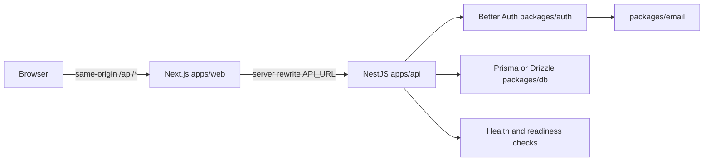

# BetterNest Boilerplate

[](https://www.npmjs.com/package/create-betternest-app)
[](https://opensource.org/licenses/MIT)
[](https://github.com/bellandry/betternest-boilerplate/actions/workflows/ci.yml)
[](./CONTRIBUTING.md)

**BetterNest Boilerplate** is a composable monorepo generator for full-stack web applications built with **Next.js**, **NestJS**, **Better Auth**, **Turborepo**, and your choice of database. The `create-betternest-app` CLI assembles a consistent project from reusable templates, optionally installs dependencies, and can initialize Git automatically.

> This boilerplate is a production-oriented starting point. It does not replace a security review, a backup strategy, or architecture decisions specific to your product and compliance requirements.

## Table of contents

- [Overview](#overview)
- [Prerequisites](#prerequisites)
- [Quick start](#quick-start)
- [CLI usage](#cli-usage)
- [Database matrix](#database-matrix)
- [Support levels and recommended paths](#support-levels-and-recommended-paths)
- [Generated project structure](#generated-project-structure)
- [Architecture](#architecture)
- [Environment configuration](#environment-configuration)
- [Local development](#local-development)
- [Authentication](#authentication)
- [Database and migrations](#database-and-migrations)
- [API and health checks](#api-and-health-checks)
- [Security and operations](#security-and-operations)
- [Deployment](#deployment)
- [Testing the boilerplate](#testing-the-boilerplate)
- [Extending the generator](#extending-the-generator)
- [Versioning and releases](#versioning-and-releases)
- [Troubleshooting](#troubleshooting)
- [Contributing](#contributing)
- [References](#references)

## Overview

BetterNest reduces the time spent assembling the common foundations of a SaaS or business application without locking the generated project to one database engine or hosting provider.

The browser communicates with a **single public origin**, the Next.js application. Next.js rewrites `/api/*` requests server-side to the NestJS API. Session cookies therefore remain first-party on the domain visible to users, while the backend can run independently on Railway, Fly.io, Render, a VPS, or any Docker-compatible platform.

| Area           | Included choice                                                                 |
| -------------- | ------------------------------------------------------------------------------- |
| Frontend       | Next.js 16, App Router, Tailwind CSS v4, and shared UI components               |
| Backend        | NestJS 11 with Express 5                                                        |
| Authentication | Better Auth with email/password, Google, and GitHub providers                   |
| Monorepo       | pnpm workspaces and Turborepo                                                   |
| Database       | Prisma or Drizzle with PostgreSQL, MySQL, or SQLite                             |
| Deployment     | Docker, Vercel, Railway, Fly.io, Render, or a VPS                               |
| Safeguards     | Environment validation, auth rate limiting, security headers, and health checks |

The repository root contains the **template system and generator**. It is not intended to run as a business application. Use the CLI to create an application project.

## Prerequisites

| Tool    | Expected version                        | Purpose                                              |
| ------- | --------------------------------------- | ---------------------------------------------------- |
| Node.js | `>=20.9.0`                              | Run the CLI, Next.js, and NestJS                     |
| pnpm    | `10.x`; generated projects use `10.6.3` | Install dependencies and manage the workspace        |
| Git     | Recent version                          | Version-control generated projects                   |
| Docker  | Recent version, optional                | Run PostgreSQL/MySQL locally and build the API image |

The generated monorepo officially supports **pnpm**. The CLI itself can be launched with `npx`, but the generated workspace contains pnpm-specific scripts and metadata. Install pnpm before working inside a generated project.

```bash
node --version
pnpm --version
git --version
docker --version       # optional
```

## Quick start

The shortest path uses Prisma with SQLite. It requires neither Docker nor an external database server.

```bash
npx create-betternest-app my-app --db=prisma-sqlite --yes
cd my-app

cp .env.example .env
cp apps/web/.env.example apps/web/.env

# Generate a secret and put the result in .env.
openssl rand -base64 32

pnpm install
pnpm db:push
pnpm dev
```

Keep `pnpm dev` running and use a second terminal to verify the complete path:

```bash
curl -fsS http://localhost:3000/api/health
curl -fsS http://localhost:3000/api/health/db
```

The first command should return `{"status":"ok"}` and the second `{"status":"ok","db":"connected"}`. The frontend is available at [http://localhost:3000](http://localhost:3000), and the API listens on port `4000` by default. Next.js proxies `/api/*` requests so browser code does not need to target the API port directly.

Before using the project with real users, replace every example value, configure the providers you selected, and read the [deployment guide](./templates/base/DEPLOYMENT.md).

## CLI usage

### Interactive mode

```bash
npx create-betternest-app my-app
```

Without options, the CLI prompts for the project name, database, authentication providers, dependency installation, and Git initialization.

### Automated mode

```bash
npx create-betternest-app my-app \
  --db=prisma-postgresql \
  --auth=email-password,google \
  --pm=pnpm \
  --yes
```

### Preview without writing files

`--dry-run` resolves the selection and prints the plan without generating files, initializing Git, or installing dependencies:

```bash
npx create-betternest-app my-app \
  --db=drizzle-sqlite \
  --auth=email-password \
  --dry-run \
  --yes
```

### Global installation

```bash
npm install --global create-betternest-app
create-betternest-app my-app
```

### Updating an existing generated project

Run the update command from the project root, or provide a project path:

```bash
create-betternest-app update --dry-run
create-betternest-app update .
```

The command adds new template files and updates files that still match the last generated snapshot. User-modified files are reported as conflicts and are never overwritten. Use `--dry-run` to preview the result. Projects generated before manifest snapshots were introduced can still receive new files, but existing differences are treated conservatively as conflicts.

### CLI options

| Option            | Value                                | Description                                                            |
| ----------------- | ------------------------------------ | ---------------------------------------------------------------------- |
| `[project-name]`  | Valid folder name                    | Name of the generated project                                          |
| `--db=<id>`       | See the matrix below                 | Selects the ORM/database combination                                   |
| `--auth=<a,b,c>`  | `email-password`, `google`, `github` | Selects comma-separated authentication providers                       |
| `--pm=pnpm`       | `pnpm` only                          | Package manager used by the generated workspace                        |
| `--install`       | —                                    | Forces dependency installation                                         |
| `--no-install`    | —                                    | Skips dependency installation                                          |
| `--git`           | —                                    | Forces Git initialization and the first commit                         |
| `--no-git`        | —                                    | Skips Git initialization                                               |
| `--skip-auth`     | —                                    | Omits Better Auth, auth routes, protected pages, and the email package |
| `--skip-email`    | —                                    | Omits the email package and email-password setup                       |
| `--skip-ui`       | —                                    | Omits `@repo/ui` and uses a small local HTML shim                      |
| `--yes`, `-y`     | —                                    | Accepts defaults and disables prompts                                  |
| `--dry-run`       | —                                    | Prints the resolved plan without writing files                         |
| `--verbose`, `-v` | —                                    | Prints additional error details                                        |
| `--help`, `-h`    | —                                    | Prints the complete CLI help                                           |

The CLI rejects unknown database/provider identifiers, entries marked as coming soon, and package managers other than pnpm.

## Database matrix

The generator provides six combinations:

| CLI identifier       | ORM     | Engine     | Local Docker |
| -------------------- | ------- | ---------- | ------------ |
| `prisma-postgresql`  | Prisma  | PostgreSQL | Yes          |
| `prisma-mysql`       | Prisma  | MySQL      | Yes          |
| `prisma-sqlite`      | Prisma  | SQLite     | No           |
| `drizzle-postgresql` | Drizzle | PostgreSQL | Yes          |
| `drizzle-mysql`      | Drizzle | MySQL      | Yes          |
| `drizzle-sqlite`     | Drizzle | SQLite     | No           |

### Support levels and recommended paths

Availability does not mean that every combination carries the same product promise. The table below is the public support contract for the current release.

| CLI identifier       | Support level   | Intended use                                               | Evidence and boundary                                                                                                  |
| -------------------- | --------------- | ---------------------------------------------------------- | ---------------------------------------------------------------------------------------------------------------------- |
| `prisma-postgresql`  | **Golden path** | New production projects and the primary deployment journey | End-to-end documentation, generated reference, CI matrix, migration contract, and deployment recipes                   |
| `prisma-sqlite`      | **Supported**   | Fast local development without external infrastructure     | Generation, install, build, lint, and smoke coverage; not the recommended multi-instance production database           |
| `prisma-mysql`       | **Supported**   | Teams that standardize on MySQL                            | Generation, install, build, lint, migration, and smoke coverage; deployment topology remains the team’s responsibility |
| `drizzle-postgresql` | **Supported**   | Teams that prefer Drizzle with PostgreSQL                  | Generation, install, build, lint, migration, and smoke coverage; not the primary onboarding path                       |
| `drizzle-mysql`      | **Supported**   | Teams that prefer Drizzle with MySQL                       | Generation, install, build, lint, migration, and smoke coverage; not the primary onboarding path                       |
| `drizzle-sqlite`     | **Supported**   | Lightweight local projects without Docker                  | Generation, install, build, lint, and smoke coverage; use the documented SQLite constraints before production adoption |

Support levels are explicit rather than implied. **Golden path** means the strongest recommended journey; **Supported** means the stated use case is covered by the repository contract, while alternatives may have less deployment guidance and regression depth. New combinations must earn their support level through tests, documentation, and a clear migration story. See the [support-level ADRs](./docs/adr/README.md) and the [generated-project definition of done](./docs/generated-project-definition-of-done.md).

```bash
# Prisma + SQLite, with no external infrastructure
npx create-betternest-app sqlite-app --db=prisma-sqlite --yes

# Drizzle + PostgreSQL, with email authentication only
npx create-betternest-app postgres-app \
  --db=drizzle-postgresql \
  --auth=email-password \
  --yes

# Prisma + MySQL, without automatic installation
npx create-betternest-app mysql-app \
  --db=prisma-mysql \
  --no-install \
  --yes
```

For PostgreSQL and MySQL, start the generated service before pushing the schema:

```bash
docker compose up -d
pnpm db:push
```

SQLite creates its local file at the path specified by `DATABASE_URL`. Keep local database files out of version control when they contain real data.

## Generated project structure

```text
my-app/
├── apps/
│   ├── api/                    # NestJS API, health checks, and Dockerfile
│   └── web/                    # Next.js application and /api/* proxy
├── packages/
│   ├── auth/                   # Server-side Better Auth instance
│   ├── db/                     # Prisma/Drizzle schema, client, and config
│   ├── email/                  # Resend or SMTP when email-password is enabled
│   ├── eslint-config/          # Shared ESLint configuration
│   ├── typescript-config/      # Shared TypeScript configurations
│   ├── ui/                     # Shared UI components
│   └── ...
├── .betternest.json            # Machine-readable generation manifest
├── .env.example                # Shared API, auth, email, and database variables
├── apps/web/.env.example       # Next.js-only variables
├── docker-compose.yml          # Generated for PostgreSQL or MySQL
├── DEPLOYMENT.md               # Detailed deployment guide
├── package.json                # Workspace root scripts
├── pnpm-workspace.yaml         # pnpm workspace and native build allowlist
└── turbo.json                  # Turborepo tasks and environment inputs
```

`.betternest.json` contains no secret. It records the selected database and authentication providers for diagnostics and future template migrations:

```json
{
  "schemaVersion": 1,
  "generatedBy": "create-betternest-app",
  "packageManager": "pnpm",
  "database": {
    "id": "prisma-sqlite",
    "label": "Prisma + SQLite",
    "orm": "Prisma",
    "engine": "SQLite"
  },
  "authProviders": ["email-password"]
}
```

## Architecture



Authentication is centralized in `packages/auth`. The frontend does not import the server-side auth instance; it uses the Better Auth client and calls `/api/auth/*` through the Next.js proxy. The API is the only layer that directly knows the database adapter and authentication secrets.

## Environment configuration

### Two environment files

| File            | Consumers                                  | Example variables                                       |
| --------------- | ------------------------------------------ | ------------------------------------------------------- |
| Root `.env`     | API, auth, database, email, shared runtime | `DATABASE_URL`, `BETTER_AUTH_SECRET`, `WEB_URL`, `PORT` |
| `apps/web/.env` | Next.js only                               | `API_URL`, `NEXT_PUBLIC_APP_URL`                        |

Initialize both files:

```bash
cp .env.example .env
cp apps/web/.env.example apps/web/.env
```

Never commit `.env`, `apps/web/.env`, OAuth secrets, or production database credentials. Only the `.env.example` files are intended for version control.

### Main variables

| Variable                      | File            | Required           | Description                                                   |
| ----------------------------- | --------------- | ------------------ | ------------------------------------------------------------- |
| `DATABASE_URL`                | `.env`          | Yes                | Prisma/Drizzle URL or SQLite path                             |
| `BETTER_AUTH_SECRET`          | `.env`          | Yes                | Secret containing at least 32 characters                      |
| `WEB_URL`                     | `.env`          | Yes in production  | Public frontend origin, for example `https://app.example.com` |
| `PORT`                        | `.env`          | No                 | API port, `4000` by default                                   |
| `API_URL`                     | `apps/web/.env` | Yes                | Backend URL used by the Next.js proxy                         |
| `NEXT_PUBLIC_APP_URL`         | `apps/web/.env` | Depending on usage | Frontend URL used for absolute server-rendered URLs           |
| `TRUSTED_PROXY_HOPS`          | `.env`          | No                 | Number of trusted reverse proxies, `1` by default             |
| `JSON_BODY_LIMIT`             | `.env`          | No                 | Maximum non-auth JSON body size, `1mb` by default             |
| `CORS_ORIGINS`                | `.env`          | No                 | Comma-separated explicit origins for direct API clients       |
| `BETTER_AUTH_TRUSTED_ORIGINS` | `.env`          | No                 | Additional frontend origins trusted by Better Auth            |
| `RATE_LIMIT_MAX`              | `.env`          | No                 | Attempts per rate-limit window, `5` by default                |
| `RATE_LIMIT_WINDOW`           | `.env`          | No                 | Window length in seconds, `900` by default                    |

Generate a strong secret:

```bash
openssl rand -base64 32
```

When credentials are enabled, never use `*` in `CORS_ORIGINS`. Declare explicit origins instead:

```dotenv
WEB_URL=https://app.example.com
CORS_ORIGINS=https://admin.example.com,https://mobile.example.com
BETTER_AUTH_TRUSTED_ORIGINS=https://staging.example.com
```

Vercel injects `VERCEL_URL` automatically. That origin is added to Better Auth trusted origins for preview deployments. Google and GitHub must still be configured with callback URLs that match your deployment strategy.

## Local development

From the root of a generated project:

```bash
pnpm install
pnpm db:generate
pnpm db:push
pnpm dev
```

| Script                   | Usage                                             |
| ------------------------ | ------------------------------------------------- |
| `pnpm dev`               | Starts the frontend and API through Turborepo     |
| `pnpm build`             | Builds all packages and applications              |
| `pnpm lint`              | Runs workspace lint checks                        |
| `pnpm format`            | Formats TypeScript, TSX, Markdown, and JSON files |
| `pnpm db:generate`       | Generates ORM clients or database artifacts       |
| `pnpm db:push`           | Synchronizes the schema in local development      |
| `pnpm db:studio`         | Opens the selected ORM studio                     |
| `pnpm db:migrate:deploy` | Applies production migrations                     |

To run one application directly:

```bash
pnpm --filter web dev
pnpm --filter api start:dev
```

The default ports are `3000` for Next.js and `4000` for NestJS. If you change `PORT`, update `API_URL` in `apps/web/.env` accordingly.

## Authentication

Providers are selected during generation:

| Provider         | Features                                                 | Main variables                                                |
| ---------------- | -------------------------------------------------------- | ------------------------------------------------------------- |
| `email-password` | Sign-up, sign-in, email verification, and password reset | `EMAIL_PROVIDER`, `EMAIL_FROM`, then Resend or SMTP variables |
| `google`         | Google OAuth                                             | `GOOGLE_CLIENT_ID`, `GOOGLE_CLIENT_SECRET`                    |
| `github`         | GitHub OAuth                                             | `GITHUB_CLIENT_ID`, `GITHUB_CLIENT_SECRET`                    |

The email/password provider uses `@repo/email`. For Resend:

```dotenv
EMAIL_PROVIDER=resend
EMAIL_FROM=noreply@example.com
RESEND_API_KEY=re_...
```

For SMTP:

```dotenv
EMAIL_PROVIDER=smtp
EMAIL_FROM=noreply@example.com
SMTP_HOST=smtp.example.com
SMTP_PORT=587
SMTP_USER=...
SMTP_PASSWORD=...
SMTP_SECURE=false
```

For local development, [Mailpit](https://github.com/axllent/mailpit) can act as a mail catcher. Set `SMTP_HOST=localhost` and `SMTP_PORT=1025`.

Local OAuth callback URLs are:

```text
http://localhost:3000/api/auth/callback/google
http://localhost:3000/api/auth/callback/github
```

In production, replace `localhost:3000` with the public origin defined in `WEB_URL`. The frontend proxy should remain the browser entry point; do not expose the API port as the OAuth origin visible to users.

## Database and migrations

### Development

`pnpm db:push` is convenient for local or disposable environments because it applies the schema directly:

```bash
pnpm db:generate
pnpm db:push
```

### Production

The boilerplate exposes one common production contract:

```bash
pnpm db:migrate:deploy
```

The generated database package delegates to the appropriate tool:

| ORM     | Underlying command      |
| ------- | ----------------------- |
| Prisma  | `prisma migrate deploy` |
| Drizzle | `drizzle-kit migrate`   |

The Docker entrypoint runs this contract before starting the API. Do not replace it with `db:push` in production without evaluating the risk of destructive schema changes or data loss.

### Admin bootstrap

Projects with the `email-password` provider expose an idempotent `pnpm db:seed` command. Set `ADMIN_EMAIL`, `ADMIN_PASSWORD`, and optionally `ADMIN_NAME` in the shell or deployment secret manager before running it. The command creates the user if absent, promotes it to `admin`, and marks its email as verified; it never embeds a default password and never changes an existing password. Automatic execution is opt-in through `SEED_ADMIN_ON_STARTUP=true` in a controlled first deployment.

Generate migrations, review them, test them against staging, and commit them with the application code. Maintain backups and a rollback procedure independent from the template generator.

## API and health checks

### Same-origin proxy

The frontend calls routes such as:

```text
/api/auth/*
/api/health
/api/health/db
/api/<your-business-routes>
```

Next.js rewrites `/api/*` to `API_URL`. Browser code should not construct a different URL for each service. Direct API clients can use CORS with an explicit `CORS_ORIGINS` list.

### Health endpoints

| Endpoint             | Requires database | Usage                                     |
| -------------------- | ----------------- | ----------------------------------------- |
| `GET /api/health`    | No                | Liveness probe and process check          |
| `GET /api/health/db` | Yes               | Readiness and database connectivity check |

```bash
curl -i http://localhost:4000/api/health
curl -i http://localhost:4000/api/health/db
```

The database health response does not expose connection details or stack traces. Diagnostic details remain in server logs.

## Security and operations

The generated configuration includes several safeguards, but production security remains an operational responsibility:

- API startup validates `DATABASE_URL`, `BETTER_AUTH_SECRET`, `PORT`, `RATE_LIMIT_MAX`, and `RATE_LIMIT_WINDOW`, then exits with a clear message when a value is invalid.
- The API applies `X-Content-Type-Options`, `X-Frame-Options`, `Referrer-Policy`, and `Permissions-Policy` headers.
- `X-Request-ID` is generated or propagated to correlate requests with logs.
- Non-auth JSON bodies are limited by `JSON_BODY_LIMIT`.
- Authentication endpoints use per-endpoint, per-IP rate limiting. The default is 5 attempts per 15 minutes.
- Multi-instance deployments should use shared storage such as Redis when rate-limit counters must be consistent across processes.
- The Docker runner uses a non-root user and the entrypoint applies migrations before startup.
- CORS and Better Auth origins are explicit. Never use `*` with credentials.

`TRUSTED_PROXY_HOPS` must match the real topology. A value that is too high can make the application trust a client-controlled IP header; a value that is too low can make rate limiting less accurate behind a reverse proxy.

## Deployment

Generated projects include an API Dockerfile and platform configuration files. The frontend and backend can be deployed independently.

### Frontend on Vercel

1. Push the generated project to GitHub.
2. Import the repository into Vercel.
3. Set the root directory to `apps/web` when using Vercel’s root-directory mode.
4. Configure `API_URL` with the backend URL.
5. Configure `NEXT_PUBLIC_APP_URL` with the public frontend URL when the application uses it.
6. Deploy the frontend and copy its public URL.
7. Set `WEB_URL` to that URL in the backend environment and redeploy the backend.

### Backend with Docker

Build from the generated project root:

```bash
docker build -f apps/api/Dockerfile -t my-app-api .
docker run --rm -p 4000:4000 \
  --env-file .env \
  my-app-api
```

The image uses multiple stages: Turborepo pruning, lockfile-based installation, compilation, and a production runner. The runner includes pnpm because the entrypoint executes `pnpm db:migrate:deploy`.

### Railway, Fly.io, and Render

| Platform | File           | Notes                                               |
| -------- | -------------- | --------------------------------------------------- |
| Railway  | `railway.json` | Attach PostgreSQL or configure an external database |
| Fly.io   | `fly.toml`     | Store each sensitive value as a platform secret     |
| Render   | `render.yaml`  | The blueprint can provision the API and PostgreSQL  |

At minimum, configure:

```dotenv
DATABASE_URL=...
BETTER_AUTH_SECRET=...
WEB_URL=https://app.example.com
PORT=4000
TRUSTED_PROXY_HOPS=1
```

Do not place secrets in `Dockerfile`, `railway.json`, `fly.toml`, `render.yaml`, or Git. Use the hosting platform’s secret variables.

### VPS with Docker Compose

A typical VPS deployment includes:

```yaml
services:
  api:
    build:
      context: .
      dockerfile: apps/api/Dockerfile
    ports:
      - '4000:4000'
    env_file:
      - .env
    restart: unless-stopped

  postgres:
    image: postgres:16-alpine
    environment:
      POSTGRES_USER: app
      POSTGRES_PASSWORD: ${POSTGRES_PASSWORD}
      POSTGRES_DB: app
    volumes:
      - pgdata:/var/lib/postgresql/data

volumes:
  pgdata:
```

Add a TLS reverse proxy such as Caddy, nginx, or Traefik in front of the frontend and API. Certificates, backups, monitoring, and secret rotation remain operational responsibilities.

The generated project also includes a [detailed deployment guide](./templates/base/DEPLOYMENT.md) covering Railway, Fly.io, Render, Vercel, and VPS scenarios.

## Testing the boilerplate

These commands run in the boilerplate repository, not in a generated application:

```bash
pnpm install
pnpm lint
pnpm build
pnpm test:unit
pnpm test:pack
pnpm smoke-test
```

| Command                 | Verification                                                                                 |
| ----------------------- | -------------------------------------------------------------------------------------------- |
| `pnpm lint`             | Strict typecheck of the generator and CLI                                                    |
| `pnpm build`            | Builds the `create-betternest-app` package                                                   |
| `pnpm test:unit`        | Checks catalog entries, six DB variants, tokens, markers, manifests, and flags               |
| `pnpm test:pack`        | Installs the npm tarball in an isolated consumer and compares its output with `examples/mvp` |
| `pnpm smoke-test`       | Generates a temporary project and runs installation, ORM generation, build, and lint         |
| `pnpm generate:default` | Regenerates `examples/mvp` with the reference selection                                      |

`examples/mvp` is a versioned reference output. Any template change must be followed by regeneration and `pnpm test:pack`. Build artifacts and generated-project lockfiles must not be added to this reference.

The CI workflow verifies the generator, builds the database matrix, and runs the generated-project smoke matrix. Docker image builds require an environment with Docker available.

## Extending the generator

Generation is driven by manifests and separated into composable template areas:

```text
templates/
├── base/                 # Files shared by every generated project
├── db/                   # Prisma/Drizzle manifests and fragments
└── auth-providers/       # Email and OAuth manifests and fragments
```

### Add a database variant

1. Create a directory under `templates/db/<id>`.
2. Add a `manifest.ts` satisfying `DbManifest`.
3. Add the Better Auth adapter fragments, database package, schema, ORM configuration, scripts, and environment fragment.
4. Add the entry to the catalog when required.
5. Add the variant to the CI matrix and contract tests.
6. Regenerate `examples/mvp` and verify the packaged CLI.

### Add an authentication provider

1. Create a directory under `templates/auth-providers/<id>`.
2. Declare a `ProviderManifest`.
3. Add the server fragment, UI component, environment variables, and README setup instructions.
4. Use page-specific UI imports when sign-in and sign-up render different components.
5. Add the corresponding generation assertions.

### Modify an existing template

`.hbs` files are tokenized and copied to the generated project. Composed files such as `package.json`, the README, authentication pages, and `packages/auth/src/index.ts` are assembled from fragments. Preserve existing markers and never put secrets into templates.

Read [CONTRIBUTING.md](./CONTRIBUTING.md) before changing the catalog, JSON merge rules, workflows, or release process.

## Versioning and releases

The publishable package is `create-betternest-app`, currently version `0.6.6`. Changes that affect the CLI or generated output should include a Changeset:

```bash
pnpm changeset
pnpm test:unit
pnpm test:pack
pnpm build
```

The release workflow uses Changesets. Available local commands include:

```bash
pnpm version-packages
pnpm release
```

Publishing requires npm credentials and appropriate CI protections. Do not publish from a development workstation before checking the tarball and the six database variants.

## Troubleshooting

### The CLI rejects `--pm=npm`, `--pm=yarn`, or `--pm=bun`

This is intentional. The CLI can be launched with `npx`, but the generated workspace officially supports pnpm. Use `--pm=pnpm`, install pnpm, and regenerate the project.

### The API exits immediately on startup

Read the environment validation message and check the main variables:

```bash
cat .env
pnpm db:generate
```

`BETTER_AUTH_SECRET` must contain at least 32 characters, `PORT` must be an integer between 1 and 65535, and rate-limit settings must be positive integers.

### Cookies or OAuth redirects do not work

Check that:

1. `WEB_URL` exactly matches the browser-visible origin, including the protocol and excluding unnecessary paths;
2. `API_URL` points to the expected backend in `apps/web/.env`;
3. Google/GitHub callbacks use the frontend domain and `/api/auth/callback/<provider>`;
4. additional origins are listed in `BETTER_AUTH_TRUSTED_ORIGINS`;
5. the backend was redeployed after changing its environment variables.

### PostgreSQL or MySQL is unavailable

Check the Docker service and `DATABASE_URL`:

```bash
docker compose ps
docker compose logs --follow
pnpm db:push
```

For SQLite, omit Docker and use a path compatible with the generated variant.

### The Docker build fails during migrations

Build from the project root, not from `apps/api`:

```bash
docker build -f apps/api/Dockerfile .
```

The root context is required by `turbo prune`, the pnpm workspace, and shared packages.

### `pnpm test:pack` reports a difference from `examples/mvp`

Regenerate the reference first, then rerun the test:

```bash
pnpm generate:default
pnpm test:pack
```

If the difference is intentional, review the diff, update the template, and document the change in a Changeset. Do not commit `node_modules`, `dist` files, `tsbuildinfo`, or lockfiles produced by a test project.

## Contributing

Contributions are welcome. Before opening a pull request:

```bash
pnpm install
pnpm lint
pnpm test:unit
pnpm test:pack
pnpm smoke-test
```

Describe the problem, expected behavior, affected templates/manifests/workflows, tested database/provider variants, documentation changes, and matching Changeset when the CLI or generated output changes.

See [CONTRIBUTING.md](./CONTRIBUTING.md) for detailed conventions. Open issues and feature requests in the [GitHub repository](https://github.com/bellandry/betternest-boilerplate/issues).

## References

1. [Next.js documentation](https://nextjs.org/docs)
2. [NestJS documentation](https://docs.nestjs.com/)
3. [Better Auth documentation](https://better-auth.com/docs)
4. [Prisma documentation](https://www.prisma.io/docs)
5. [Drizzle ORM documentation](https://orm.drizzle.team/docs/overview)
6. [pnpm documentation](https://pnpm.io/)
7. [Turborepo documentation](https://turborepo.com/docs)
8. [Docker documentation](https://docs.docker.com/)
9. [Vercel documentation](https://vercel.com/docs)
10. [Railway documentation](https://docs.railway.com/)
11. [Fly.io documentation](https://fly.io/docs/)
12. [Render documentation](https://render.com/docs)
13. [Repository contribution guide](./CONTRIBUTING.md)
14. [Template deployment guide](./templates/base/DEPLOYMENT.md)

## License

The package manifest declares the project under the **MIT** license. See the [MIT License](https://opensource.org/licenses/MIT) for the license terms.
